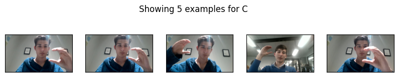

# ASL AI Interpreter

An advanced American Sign Language (ASL) interpreter using AI and computer vision, built with PyQt5, OpenCV, and MediaPipe. This application captures video from your webcam, processes the frames to recognize ASL gestures, and displays the detected gestures in a console.

## Features

- Real-time video processing with OpenCV
- ASL gesture recognition using MediaPipe
- PyQt5-based graphical user interface
- Privacy policy information
- GitHub link for project repository
- Console to display detected gestures

## Installation

### Prerequisites

Ensure you have Python 3.8 or higher installed on your system.

### Steps

1. **Clone the repository**:

    ```sh
    git clone https://github.com/your-username/ASL-AI-Interpreter.git
    cd ASL-AI-Interpreter
    ```

2. **Create and activate a virtual environment** (optional but recommended):

    ```sh
    python -m venv venv
    source venv/bin/activate  # On Windows, use `venv\Scripts\activate`
    ```

3. **Install the required packages**:

    ```sh
    pip install -r requirements.txt
    ```

4. **Run the application**:

    ```sh
    python gui.py
    ```

## Usage

1. Launch the application by running `gui.py`.
2. The webcam feed will start automatically.
3. Use the activation switch to toggle gesture recognition on or off.
4. Detected gestures will be displayed in the console.
5. Use the buttons for privacy policy information, opening the GitHub repository, and clearing the console.

## Example ASL Hand Gestures

Below are some example ASL hand gestures recognized by the application:




## Code Structure

- `gui.py`: Main application code, including the GUI and video processing.
- `gestures.py`: Contains the `GestureRecognizerThread` class for gesture recognition.
- `PrivacyDialog`: Class for the privacy policy dialog.
- `WebcamWidget`: Main widget for displaying the video feed and recognized gestures.

## Privacy Policy

This application respects your privacy. It does not store or transmit any video data. All processing is done locally on your device.

## Contributing

Feel free to fork this repository, create a new branch, and submit a pull request with your improvements. Contributions are welcome!

## License

This project is licensed under the MIT License. See the [LICENSE](LICENSE) file for more details.

## Contact

For any questions or suggestions, please open an issue on GitHub or contact us at [21082@student.macleans.school.nz](mailto:21082@student.macleans.school.nz).

---

### Example Command to Clone and Run

```sh
git clone https://github.com/your-username/ASL-AI-Interpreter.git
cd ASL-AI-Interpreter
python -m venv venv
source venv/bin/activate  # On Windows, use `venv\Scripts\activate`
pip install -r requirements.txt
python gui.py
